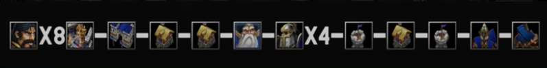
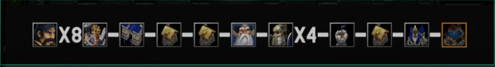
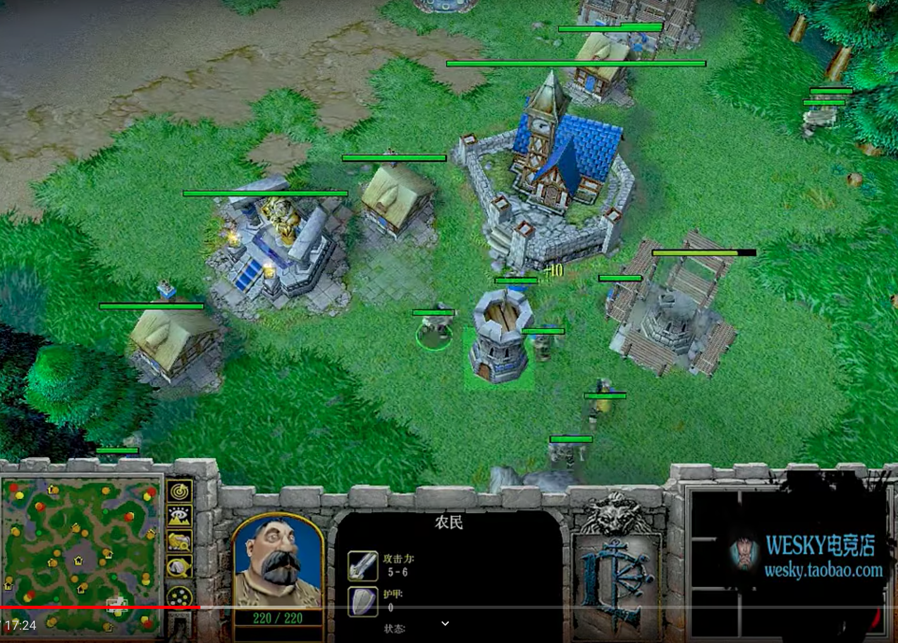
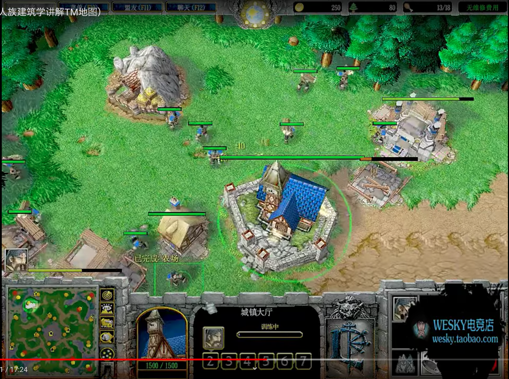
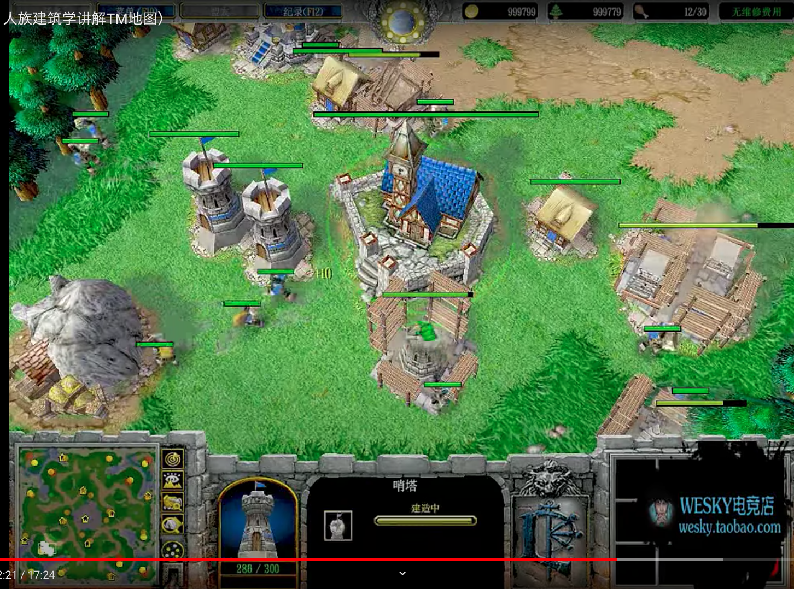
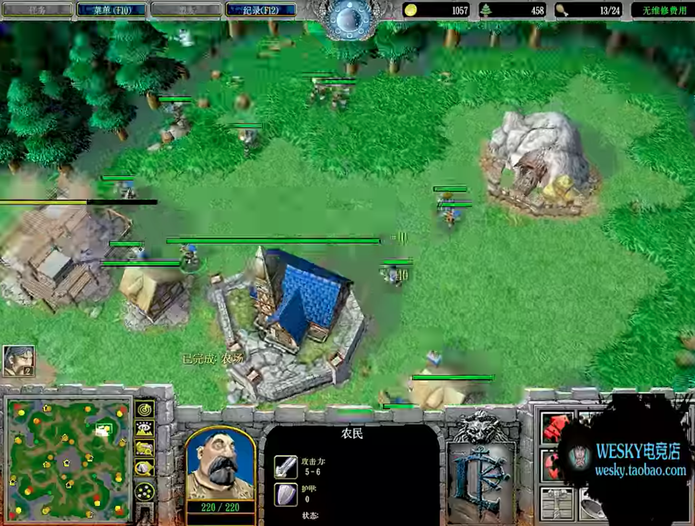

## 前言

为了学习人族战术和打法, 总结一下人族的开局和建筑学.  希望切磋交流, 增进学习. 

## 速矿开局

**顺序:**

- 开局4农采矿. 一个农民造祭坛, shift点木头, 造完祭坛直接采木, 或者可以造完祭坛之后变民兵侦查. 
- 第一个农民出来之后先做一个农场堵路做建筑学, 然后放弃农场造兵营. 
- 第二个农民出来造第一个农民做的农场. 这个农民直接shift造第二和第三个农场. 
- 第三个农民采金. 之后农民都默认采木, 按上图的建筑顺序走. 

**注意:** 

- 前期要多补一些农民, 人族最少要保障6农民采木. 
- **可以学infi分矿升本, 这样分矿可以出民兵**
- 这个战术必须研究分矿建筑学, 至关重要. 而且必须根据每个地图设计建筑学
- 人族的塔现在削弱了, 以目前的版本来看流行的是分矿五个农民先全力敲基地, 基地好了之后造做塔.

**优势:**

- 分矿. 有钱就是爷
- **这个战术是人族必备战术, 必须熟练掌握.**  掌握了timing和建筑学之后用起来会很顺手, 基本就打成守分矿局, 守住就赢, 守不住就输. 

**劣势:** 

- 分矿如果守不住就是大劣势. 
- 慢科技. 不过影响不大, 人族科技二本基本够用. 

**适用战术:** 

- 这是人族最常用的战术. 除了内战不用之外, 其他三个族都能用, 并且什么战术都可以用, 非常灵活. 

**适用地图:**

- 开矿容易图, 分矿近点图, EI, LR, NI

## 单矿科技开局

**顺序:** 

- 开局4农采矿. 一个农民造祭坛, shift点木头, 造完祭坛直接采木, 或者可以造完祭坛之后变民兵侦查. 
- 第一个农民出来之后先做一个农场堵路做建筑学, 然后放弃农场造兵营. 
- 第二个农民出来造第一个农民做的农场. 这个农民直接shift造第二个农场. 
- 第三个农民采金. 第四个农民采木. 
- 之后的农民集结采木头, 然后比较随意了. 建筑顺序按上面那个图来就可以. 
- 这个开局因为前期footmen够多, 而且没有分矿要守, 没有必要做伐木场. 伐木场可以后补. 8个农民也不会缺木

**优势:** 

- 比较安全, 前期不用守分矿.
- 快科技
- 易于转型. 由于快科技的原因, 方便快速到二本. 

**劣势:**

- 弱经济
- 容错率低. 单矿的人族一旦劣势几乎是不很难翻盘的. 
- 中期需要找机会开矿, 不开矿的人族没什么前途. 

**适用战术:** 

- 一波流, 也就是sky流. 就是用这个开局, 速科技到二本酒馆英雄带塔一波.  一波流可以打暗夜和兽族. 
- 对UD, 圣骑首发, 前期footmen过度, 速三本出骑士飞机的战术. 家里要补一两个箭塔防UD二本rush. 
- 据说**人族内战都是用这个开局**的, 不用就是菜. 据说人族内战开局是开不了矿的, 开矿除非是大图, 不然必备对方单矿高人口的部队推掉. 

**适用地图:**

- 分矿难开图都适用, TM, 龟岛. 
- 不适合开矿相对容易的图, 比如NI. 人族前期不开矿, 中期如果打不赢的话, 就很难再开. 

## 快祭坛开局

**顺序:**

- 这个开局的祭坛是双敲的, 开局二农民采矿, 两个农民造祭坛shift采木, 一个农民造房子shift采金. 
- 第一个农民采金
- 第二个农民建兵营
- 第三个农民造第二个农场, 之后按上图走. 

**注意:** 

- **在一些怪很强的图(TM的地精实验室石头人), 大法刚出来就练级的话, 采木农民是不够的, 这个时候需要连采矿农民一起拉.**
- **TM要拉总共七个农民, 从采矿的农民中拉两个, 不要怕死农民, 有的农民必死, TM怪有减速, 没必要往回拉.**

**优势:** 

- 第一英雄迅速到2直接产生等级优势. 
- 因为是双敲祭坛, 可以在对方骚扰英雄赶来之前到二, 避免被骚扰. 
- 此战术非常灵活. 因为等级优势有一波强势期. 这个时候, 可以看情况转型, 选择爆兵压对面, 也可以选择单矿科技, 还可以再来一波民兵开矿. 因为有等级优势所以分矿开的相对容易. 

**劣势:** 

- 到二级确实是有优势, 但是大法到二和一级的差别不明显, 三级才有飞跃. 
- 刷人品, 如果TM近点的话, 对方剑圣还是能赶来砍几刀的, 不是完全不会被骚扰. 
- 会死农民, 科技慢, 经济也慢. 

**适用战术:** 

- 人族快祭坛的作用有且只有一个. 就是为了第一个英雄(通常是大法)出来之后立刻练一个黄点到二级. 
- 这个战术只有在特殊地图才有必要. 比如TM有些点位对人族很不利, 必须用这个战术. 据说高手会根据TM不同的点位用不同的开局. 
- 有的MK首发的情况练雇佣兵营也会用到这个战术, 比如LR, MK练级效率低. 
- 此战术适用血法单发猥琐流. 

**适用地图:**

- TM, 龟岛, LR, CH

## 商店快科技开局

**顺序:** 

- 开局4农采矿. 一个农民造祭坛, 造完祭坛造第二个农场.
- 第一个农民出来之后造第一个农场, 之后shift造商店.
- 第二个农民采金
- 第三个农民之后全默认采木, 然后按上图建筑顺序走. 
- 二本之后, 一共9个采木农民, 三个一组速敲神秘圣地, 一共敲三个神秘圣地. 
- 二发自由, 不用按上图血法, 可以MK

**注意:** 

- **这是一个偷的战术**. 前期无兵营无塔. 所以大法练完第一个点位要迅速去兽族家里放水人牵制. 

**优势:** 

- 单矿速本, 直接过渡二本, 前期省了一大笔钱, 不用造footmen给兽族送经验, 直接出好用的三法. 

**劣势:** 

- 家里没塔, 剑圣进不去, 但挡不住先知. 我知道作者这么设计是想省钱, 但可以考虑家里起一根塔? 

**适用战术:**

- 这个战术仅仅适用于兽族. 因为对战兽族的时候footmen出再多都是经验, 索性不做兵营, 速二本出对抗兽族的万金油三法. 

**适用地图:** 

- 兽族大优图, 比如SV和CH.

## TM 4个点位建筑学 from sky

**要点总结(sky亲述):**

- 一字摆放, 封口, 祭坛的位置相对兵营尽量向后, 因为血少. 
-  防御塔不要摆在最前面, 除非是面对兽族. 要摆在基地后面, 跟基地保持一个footmen的距离. 这样不会被敌方远程单位轻易打掉.

## EI 建筑学 from Infi

