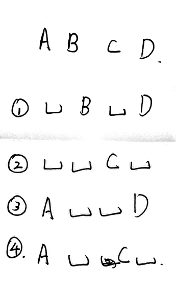
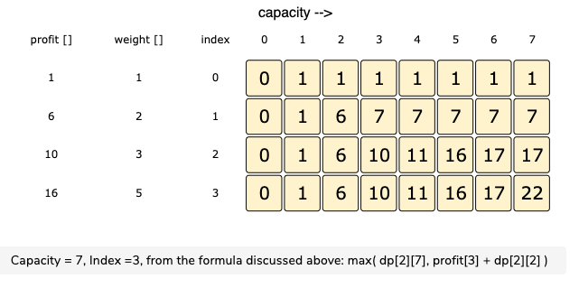

## Overview

DP相关的问题一直是我比较吃力和难以理解的一块. 希望通过总结知识点和相关题目能够增强对DP问题的理解. 

窍门: 

**如果写不出通式的话, 就从basic case一个一个写下去, 1,2,3,4, 多写几个就会有思路.**

## Fibonacci 类问题

Fibonacci类的DP有一系列问题. 这种问题的特点有几点: 

1. 都是那种通过前后叠加去解决. 就是上楼梯问题. 
2. 可以通过 Divide-Conquer 化解成 basic problem, 然后解决. 
3. 表面上第一想到的通常用递归解决, 但用递归的话, 有指数复杂度. 
4. 这一类我归结为单纯叠加, 不涉及Max和Min之类的问题, 相对来说比较简单. 

### Fibonacci 

**Description**

The Fibonacci numbers, commonly denoted F(n) form a sequence, called the Fibonacci sequence, such that each number is the sum of the two preceding ones, starting from 0 and 1. That is,

> F(0) = 0,   F(1) = 1  
> F(N) = F(N - 1) + F(N - 2), for N > 1.

Given N, calculate F(N).

**Solution**

```java
class Solution {
    public int fib(int N) {
        
        if (N == 0)
        {
            return 0;
        }
        
        if (N == 1)
        {
            return 1;
        }
        
        int[] dp = new int[N+1];
        dp[0] = 0;
        dp[1] = 1;
        
        for (int i=2; i<N+1; i++)
        {
            dp[i] = dp[i-1] + dp[i-2];
        }
        
        return dp[N];
    }
}
```

### Climbing Stairs

**Description**

You are climbing a stair case. It takes n steps to reach to the top.

Each time you can either climb 1 or 2 steps. In how many distinct ways can you climb to the top?

Example 1:

> Input: 2  
> Output: 2  
> Explanation: There are two ways to climb to the top.  
> 1. 1 step + 1 step  
> 2. 2 steps  

Example 2:

> Input: 3  
> Output: 3  
> Explanation: There are three ways to climb to the top.  
> 1. 1 step + 1 step + 1 step  
> 2. 1 step + 2 steps  
> 3. 2 steps + 1 step  

**Algorithm**

As we can see this problem can be broken into subproblems, and it contains the optimal substructure property i.e. its optimal solution can be constructed efficiently from optimal solutions of its subproblems, we can use dynamic programming to solve this problem.

One can reach ith step in one of the two ways:

1. Taking a single step from `(i-1)th` step.
2. Taking a step of 22 from `(i-2)th` step.

So, the total number of ways to reach ith is equal to sum of ways of reaching `(i-1)th` step and ways of reaching `(i-2)th` step.

Let `dp[i]` denotes the number of ways to reach on ith step:

`dp[i]=dp[i-1]+dp[i-2]`


**Solution**

```java
class Solution {
    public int climbStairs(int n) {
        if (n == 1) {
            return 1;
        }
        int[] dp = new int[n + 1];
        dp[1] = 1;
        dp[2] = 2;
        for (int i = 3; i <= n; i++) {
            dp[i] = dp[i - 1] + dp[i - 2];
        }
        return dp[n];
    }
}
```

## 叠加后求Max/Min问题

特点: 

1. DP 有一个basic case, 从basic case扩展出一个general case
2. 这一类可以算是Fibonacci之上扩展出求Max/Min的问题
2. DP从头递增/递减才能够计算. 不存在从中间或者什么奇怪的地方突然冒出来的DP
3. DP基本都会涉及到Max 和 Min, 在Java之中用的是: `Math.max(a,b)`
4. 基于第三点, DP的Max和Min存在叠加性, 即上一轮的Max可以保证这一轮的Max, 不存在诡异的地方影响. 这一点要牢记

### House Robber

**Description**

You are a professional robber planning to rob houses along a street. Each house has a certain amount of money stashed, the only constraint stopping you from robbing each of them is that adjacent houses have security system connected and **it will automatically contact the police if two adjacent houses were broken into on the same night.**

Given a list of non-negative integers representing the amount of money of each house, determine the maximum amount of money you can rob tonight **without alerting the police.**

Example 1:

> Input: nums = [1,2,3,1]  
> Output: 4  
> Explanation: Rob house 1 (money = 1) and then rob house 3 (money = 3).  
>              Total amount you can rob = 1 + 3 = 4.  
             
Example 2: 

> Input: nums = [2,7,9,3,1]  
> Output: 12  
> Explanation: Rob house 1 (money = 2), rob house 3 (money = 9) and rob house 5 (money = 1).  
>              Total amount you can rob = 2 + 9 + 1 = 12.  

**Algorithm**

This problem is equal to given an array, the solution is to find the maximum sum subsequence where no two selected elements are adjacent. So the approach to the problem is a recursive solution. So there are two cases.

Basic case:
1. no element, return 0;
2. one element, return it. 
3. 2 element, return max(first element, second element. 

General:
Two ways to reach max for ith element. 
1. `nums[i] + dp[i-2]`
2. `dp[i-1]`

比较这两种方法, 求二者之中的最大值, 即为`dp[i].` 

**Solution**

```java
class Solution {
    public int rob(int[] nums) {
        int n = nums.length;
        if (n == 0) 
        return 0; 
        if (n == 1) 
            return nums[0]; 
        if (n == 2) 
            return Math.max(nums[0], nums[1]); 
   
        // dp[i] represent the maximum value stolen 
        // so far after reaching house i. 
        int[] dp = new int[n]; 
   
        // Initialize the dp[0] and dp[1] 
        dp[0] = nums[0]; 
        dp[1] = Math.max(nums[0], nums[1]); 
   
        // Fill remaining positions 
        for (int i = 2; i<n; i++) 
            dp[i] = Math.max(nums[i]+dp[i-2], dp[i-1]); 
   
        return dp[n-1]; 
    }
}
```

**分析**

这道题的话, 我自己做的话, 第一次是想不到标准答案那么完美的情况. 
如下图, 我会考虑从D点出发,为了避免相邻, 有四种情况, 我会从四种情况之中求max. 



如下, 是考虑了三中情况(图中1,3,4)而写出的答案.  但其实标准答案之中只考虑了三个量, 没有考虑A的存在, 因为A已经被其他dp包含了. **但其实并不用过度担心这种多写**. 因为Max这个方法是不会增加算力的. 即便多考虑几种情况放到max之中, 在LC之中依然是比100%的人跑得快.  所以这里也是DP的一个特点, **DP看起来都很吓人, 但多动笔写写base case其实很容易出来**. 

另, **这也就是Max问题和单纯Fibonacci的区别.**  Fibonacci类需要考虑所有情况, 而Max类只需要考虑Max就可以. 

```java
class Solution {
    public int rob(int[] nums) {
        int n = nums.length;
        if (n == 0) 
        return 0; 
        if (n == 1) 
            return nums[0]; 
        if (n == 2) 
            return Math.max(nums[0], nums[1]); 

   
        // dp[i] represent the maximum value stolen 
        // so far after reaching house i. 
        int[] dp = new int[n]; 
   
        // Initialize the dp[0] and dp[1] 
        dp[0] = nums[0]; 
        dp[1] = Math.max(nums[0], nums[1]); 
        dp[2] = Math.max(nums[2]+dp[0], dp[1]);
   
        // Fill remaining positions 
        for (int i = 3; i<n; i++) 
            //dp[i] = Math.max(nums[i]+dp[i-2], dp[i-1]);
            // 以上为标准答案的dp通式, 下面写的这个冗长, 考虑了三种, 但是不会增加算力. 
            dp[i] = Math.max(nums[i]+dp[i-3], Math.max(nums[i]+dp[i-2], dp[i-1]));
   
        return dp[n-1]; 
    }
}
```

## Matrix dp 问题

这个类型的dp, 我还没想好是否单独分一个类. 其主要的特点就是由一个matrix dp去解决, 出现了二维化, 而不仅仅是前面的一维. 

这一块是比较难了. 即使能想明白, 也不一定能写对, 即使能写对也不一定能在规定的时间内写对.  对这一块目前来说还是学习和了解为主, 不需要完全掌握. 

其实如果真理解的话, 其实这一套和一维的也不见得有很大区别.**最大区别也就是多了一个capacity的给定量**. 上边的题目没有限制, 只要去max就可以了, 而这个不同, 在一个有限的范围内给出max. 从而要不断去track这个给定量. 只要抓住这个关键点, 思路就清晰了很多. 

### Non-Fractional Knapsack

关于这个问题, 这个[guide](https://www.educative.io/courses/grokking-dynamic-programming-patterns-for-coding-interviews/RM1BDv71V60#bottom-up-dynamic-programming)写的最好了. 我下面的东西基本都是从这个guide里面来的, 改动很小. 

**Problem Description**

Given the weights and profits of ‘N’ items, we are asked to put these items in a knapsack which has a capacity ‘C’. The goal is to get the maximum profit from the items in the knapsack. Each item can only be selected once, as we don’t have multiple quantities of any item.

Constraints: 

1. an item cannot be used more than twice.    
2. In the list, there is only one item for each weights.    
3. If you take an item, you have to take it as a whole (non-fractional).    

Example:    

Items: { Apple, Orange, Banana, Melon }   
Weights: { 2, 3, 1, 4 }   
Profits: { 4, 5, 3, 7 }   
Knapsack capacity: 5   

We can have the following combinations:   

Apple + Orange (total weight 5) => 9 profit   
Apple + Banana (total weight 3) => 7 profit   
Orange + Banana (total weight 4) => 8 profit   
Banana + Melon (total weight 5) => 10 profit   

**Algorithm**

Essentially, we want to find the maximum profit for every sub-array and for every possible capacity. **This means, `dp[i][c]` will represent the maximum knapsack profit for capacity `‘c’` calculated from the first `‘i’` items.**

So, for each item at index `‘i’ (0 <= i < items.length)` and capacity`‘c’ (0 <= c <= capacity) `, we have two options:

1. Exclude the item at index ‘i’. In this case, we will take whatever profit we get from the sub-array excluding this `item => dp[i-1][c]`
2. Include the item at index ‘i’ if its weight is not more than the capacity. In this case, we include its profit plus whatever profit we get from the remaining capacity and from remaining `items => profits[i] + dp[i-1][c-weights[i]]`

其实从这里我们就可以看出, 二维和一维的情况是一样的, 无非两种情况, 选或者不选.  只不过多了一个capacity的量而已, 需要根据不同的capacity去track而已, 多了一个维度. 

Finally, our optimal solution will be maximum of the above two values:

    dp[i][c] = max (dp[i-1][c], profits[i] + dp[i-1][c-weights[i]]) 
    
  
  Given input of :        ` int[] profits = {1, 6, 10, 16};   int[] weights = {1, 2, 3, 5};`, we have a matrix dp of such: 
  
  
  
  **Code**
  
  1. 这个code没有递归的, 我觉得是我看过的比较简洁易懂的, 只用一个方法. traverse一遍而已. 没有浪费memory
  2. 这个方法是从前往后走, 即从前往后走. 
  3. 这个guide之中给的例子的两个list都是sorted, 我不确定unsorted的时候这个方法还能不能用. 应该是不行. 
  2. basic case 分为三步,  
  	- check edge case, 各种等于0. 
	- set column 0, 
	- set row 0. 
  3. general case 就像前面说过的, 无非两种情况, traverse 到 ith item的时候只有两种情况: 选或者不选, 然后取max. 
  4. 代码很吓人, 但像之前说的其实只有两种情况, 多看几分钟结合那个图看自然就看懂了. 可以去[guide](https://www.educative.io/courses/grokking-dynamic-programming-patterns-for-coding-interviews/RM1BDv71V60#bottom-up-dynamic-programming)看一眼, 里面有动画. 


  
  ```java
  public class KnapSack {

    public int solveKnapsack(int[] profits, int[] weights, int capacity) {
        // dp[i][c] will represent the maximum knapsack profit for capacity ‘c’ calculated from the first ‘i’ items.

        // basic checks
        if (capacity <= 0 || profits.length == 0 || weights.length != profits.length)
            return 0;

        int n = profits.length;
        int[][] dp = new int[n][capacity + 1];

        // populate the capacity=0 columns, with '0' capacity we have '0' profit
        for(int i=0; i < n; i++)
            dp[i][0] = 0;
	
	  // Set row 0, i=0 means we are only allowed to take 0th item which is the first itme. 
        // if we can only take the first item, we will take it if it is not more than the capacity
        if(weights[0] <= capacity)
        {
            for(int c=weights[0] ; c <= capacity; c++) {
                dp[0][c] = profits[0];
            }
        }


        // process all sub-arrays for all the capacities
        for(int i=1; i < n; i++) {
            for(int c=1; c <= capacity; c++) {
                int profit1= 0, profit2 = 0;
                // include the item, if it is not more than the capacity
                if(weights[i] <= c)
                    profit1 = profits[i] + dp[i-1][c-weights[i]];
                // exclude the item
                profit2 = dp[i-1][c];
                // take maximum
                dp[i][c] = Math.max(profit1, profit2);
            }
        }

        // maximum profit will be at the bottom-right corner.
        return dp[n-1][capacity];
    }

    public static void main(String[] args) {
        KnapSack ks = new KnapSack();
        int[] profits = {1, 6, 10, 16};
        int[] weights = {1, 2, 3, 5};

        int maxProfit = ks.solveKnapsack(profits, weights, 7);
        System.out.println("Total knapsack profit ---> " + maxProfit);

        maxProfit = ks.solveKnapsack(profits, weights, 6);
        System.out.println("Total knapsack profit ---> " + maxProfit);
    }
}
```

### Coin Machine