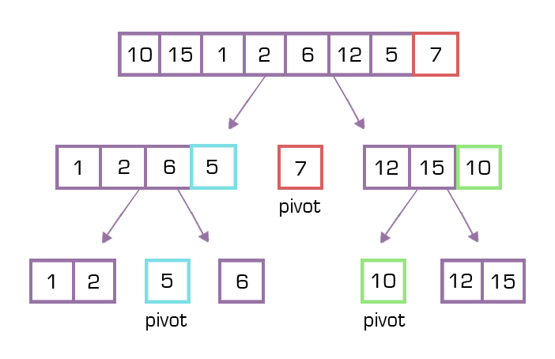

## Overview

Sorting 这一块就很搞笑. 学了多少次, 至少学了有3-4次了. 然后名字都知道, 就是记不住, 学了忘,忘了学. 最后就记住insertion和selection.   
这一次全部总结一下, 以后也就不用查了, 直接到这里看. 

Bubble sort 是纯brutal force, selection sort稍微聪明一些, 也没好到哪里去.  Insertion sort完全在任何情况都比selection快. 所以其实这三种都可以不怎么看. **重点在于Merge sort**, 既是divde&conquer, 还考察recursive, 需要重点掌握.  Quick值得了解, 用的不多. 

## Bubble Sort

最基本的brutal force sorting, 任何场合都不会用到.   就是从头到尾一遍一遍的过n次, 如果前一个比后一个大就swap,直到没有swap为止. 

### Algorithm

1. Repeatedly swapping the adjacent elements if they are in wrong order.
2. First go from 0 to n-1, keep swaping so we have the largest element in the end. 
3. Then go from 0 to n-2, and so on. 
4. If no swap happens, then break loop. It will take at most n-1 times to traverse the array. 


### Code

```java
// An optimized version of Bubble Sort 
static void bubbleSort(int arr[], int n) 
{ 
    int i, j, temp; 
    boolean swapped; 
    for (i = 0; i < n - 1; i++)  
    { 
    	// 此处用n-1次for loop可以保证最后一定sorting, 也可以用while(!swap), 效果是一样的
        swapped = false; 
        for (j = 0; j < n - i - 1; j++)  
        { 
            if (arr[j] > arr[j + 1])  
            { 
                // swap arr[j] and arr[j+1] 
                temp = arr[j]; 
                arr[j] = arr[j + 1]; 
                arr[j + 1] = temp; 
                swapped = true; 
            } 
        } 
  
        // IF no two elements were  
        // swapped by inner loop, then break 
        // 这是一个optimal的算法, 也可以不用swapped这个量, 直接走n次, 能保证最后一定是sorted. 
        if (swapped == false) 
            break; 
    } 
} 
```
### Space and Time Complexity

- Worst and Average Case Time Complexity: O(n*n). Worst case occurs when array is reverse sorted.

- Best Case Time Complexity: O(n). Best case occurs when array is already sorted.

## Selection Sort

就是brutal,  两个for loop, 从头到尾刷一遍, 找最小, 塞到第一个, 然后再找最小, 塞到第二个, 以此类推. 

### Algorithm

Repeatedly finding the minimum element from unsorted part and putting it at the beginning. 

### Code

```java
void selectionSort(int arr[], int n) 
{ 
    int i, j, min_idx; 
  
    // One by one move boundary of unsorted subarray 
    for (i = 0; i < n-1; i++) 
    { 
        // Find the minimum element in unsorted array 
        min_idx = i; 
        for (j = i+1; j < n; j++) 
          if (arr[j] < arr[min_idx]) 
            min_idx = j; 
  
        // Swap the found minimum element with the first 
        // element 
        int temp = arr[min_idx]; 
        arr[min_idx] = arr[i]; 
        arr[i] = temp;
    } 
} 
```

### Space and Time Complexity

O(n^2)

## Insertion Sort

也很brutal, 整个array从头到尾刷一遍, 如果后一个比前一个小, 就用while loop跟上一个比较往前挪, 直到挪到适当的位置为止. 

### Algorithm

To sort an array of size n in ascending order:  

1. Iterate from arr[1] to arr[n] over the array.
2. Compare the current element (key) to its predecessor.
3. If the key element is smaller than its predecessor, compare it to the elements before. Move the greater elements one position up to make space for the swapped element.


### Code

```java
    void sort(int arr[]) 
    { 
        int n = arr.length; 
        for (int i = 1; i < n; ++i) { 
            int key = arr[i]; 
            int j = i - 1; 
  
            /* Move elements of arr[0..i-1], that are 
               greater than key, to one position ahead 
               of their current position */
            while (j >= 0 && arr[j] > key) { 
                arr[j + 1] = arr[j]; 
                j = j - 1; 
            } 
            arr[j + 1] = key; 
        } 
    } 
```

### Space and Time Complexity

O(n^2)


## Merge Sort (需要掌握 | 最快)

- 最常见最好用的sorting,没有之一. 对unsorted list通杀. 优点就是快. 对LinkedList也能用, LC148.
- Merge Sort is a Divide and Conquer algorithm.
- 简单来说就是用二分法把这个array不断二分, 最后分成一个数的时候再互相比较重新拼回去. 
- **Merge sort 是递归. 值得刷!**
- [Best Merge Sort guid I found on Internet](https://www.studytonight.com/data-structures/merge-sort#:~:text=Time%20complexity%20of%20Merge%20Sort,space%20as%20the%20unsorted%20array.)

### Algorithm

- break the given array in the middle. 
- Keep breaking each part until we get each subarray with single element. 
- Since each array only have one element, so they are all sorted. Then we merge these arrays back together. It only takes O(n) to merge two sorted arrays. So the divide will take O(logn), which gives us total time complexity of O(nlogn). 


MergeSort(arr[], l,  r)  
If r > l

 1. Find the middle point to divide the array into two halves:  
         middle m = (l+r)/2
 2. Call mergeSort for first half:   
         Call mergeSort(arr, l, m)
 3. Call mergeSort for second half:
         Call mergeSort(arr, m+1, r)
 4. Merge the two halves sorted in step 2 and 3:
         Call merge(arr, l, m, r)
      


### Code

```java
public class CS627_AS02 {
    // Main function that sorts arr[l..r] using
// merge()
    void sort(int arr[], int l, int r)
    {
        if (l < r) {
            // Find the middle point
            int m = (l + r) / 2;

            // Sort first and second halves
            // 注意!! 看这个recursive, 这里是用的近似于DFS的搜索, 搜到第一个, 然后再merge.
            //  一个对merge的错误印象是先divide后combine, 而其实是divide, combine同时进行.
            // 脑子里可以再仔细想想这个recursion, 也可以回去看一下DFS. 递归需要思考.
            sort(arr, l, m);
            sort(arr, m + 1, r);

            // Merge the sorted halves
            merge(arr, l, m, r);
        }
    }

    // Merges two subarrays of arr[].
// First subarray is arr[l..m]
// Second subarray is arr[m+1..r]
    void merge(int arr[], int l, int m, int r)
    {
        // Find sizes of two subarrays to be merged
        int n1 = m - l + 1;
        int n2 = r - m;

        /* Create temp arrays */
        int L[] = new int[n1];
        int R[] = new int[n2];

        /*Copy data to temp arrays*/
        for (int i = 0; i < n1; ++i)
            L[i] = arr[l + i];
        for (int j = 0; j < n2; ++j)
            R[j] = arr[m + 1 + j];

        /* Merge the temp arrays */

        // Initial indexes of first and second subarrays
        int i = 0, j = 0;

        // Initial index of merged subarry array
        int k = l;

    /* 注意!! 当年学的时候比较疑惑, 两个array combine的时候不应该还是O(n^2)吗?
    	其实不然, 两个unsorted array才是O(n^2).  两个sorted array combine 用这个while loop O(n)就够了.
   	*/
        while (i < n1 && j < n2) {
            if (L[i] <= R[j]) {
                arr[k] = L[i];
                i++;
            }
            else {
                arr[k] = R[j];
                j++;
            }
            k++;
        }

        /* Copy remaining elements of L[] if any */
        while (i < n1) {
            arr[k] = L[i];
            i++;
            k++;
        }

        /* Copy remaining elements of R[] if any */
        while (j < n2) {
            arr[k] = R[j];
            j++;
            k++;
        }
    }

    // Driver method
    public static void main(String args[])
    {
        int arr[] = { 12, 11, 13, 5, 6, 7 };

        System.out.println("Given Array");
        //printArray(arr);

        CS627_AS02 ob = new CS627_AS02();
        ob.sort(arr, 0, arr.length - 1);

        String arrayString = "";
        for(int i=0; i<arr.length;i++)
        {
            arrayString = arrayString + arr[i] + ",";
        }

        System.out.println(arrayString.substring(0, arrayString.length() - 1));
    }
}
```

**For Practice(已存)**

```java
import java.util.Arrays;

class MergeSortPractice{
    public static void main(String[] args){
        int[] list = {3,4,2,1,5,0,3,100,2,3,93,24,43};
        mergeSort(list);
        System.out.println(Arrays.toString(list));
    }

}


// public static void mergeSort(int[] arr){
//     int[] temp =new int[arr.length];
//     internalMergeSort(arr, temp, 0, arr.length-1);
// }
// private static void internalMergeSort(int[] arr, int[] temp, int left, int right){ 
//     //当left==right的时，已经不需要再划分了
//     if (left<right){
//         int middle = (left+right)/2;
//         internalMergeSort(arr, temp, left, middle);          //左子数组
//         internalMergeSort(arr, temp, middle+1, right);       //右子数组
//         mergeSortedArray(arr, temp, left, middle, right);    //合并两个子数组
//     }
// }
// // 合并两个有序子序列
// private static void mergeSortedArray(int arr[], int temp[], int left, int middle, int right){ 
//     int i=left;      
//     int j=middle+1;
//     int k=0;
//     // Sort and combine into a new temp array. O(n)
//     while (i<=middle && j<=right){
//         temp[k++] = arr[i] <= arr[j] ? arr[i++] : arr[j++];
//     }
//     while (i <=middle){
//         temp[k++] = arr[i++];
//     }
//     while ( j<=right){
//         temp[k++] = arr[j++];
//     }
//     //把数据复制回原数组
//     for (i=0; i<k; ++i){
//         arr[left+i] = temp[i];
//     }
// }
```

### Space and Time Complexity

As we have already learned in Binary Search that whenever we divide a number into half in every stpe, it can be represented using a logarithmic function, which is `log n `and the number of steps can be represented by `log n + 1` (at most)

Also, we perform a single step operation to find out the middle of any subarray, i.e. `O(1)`.

And to merge the subarrays, made by dividing the original array of `n` elements, a running time of `O(n)` will be required.

Hence the total time for `mergeSort` function will become `n(log n + 1)`, which gives us a time complexity of `O(n*log n)`.
<br><br><br>

- Worst Case Time Complexity [ Big-O ]: `O(n*log n)`

- Best Case Time Complexity [Big-omega]: `O(n*log n)`

- Average Time Complexity [Big-theta]: `O(n*log n)`

- Space Complexity: `O(n)`

## Quick Sort

- 跟 merge sort 一样是divide and conquer
- 相较于merge sort直接二分, quick是选一个节点进行比较, 然后把节点放在对的位置, 保证节点前比其小, 后面比节点都大, 之后再进行二分. 
- 选节点pivot的方法可以自由发挥, 没有固定规定.
- 与merge sort的不同在于拼回去的过程之中无需再比较

### Algorithm

- Select a 'pivot' element from the array and partitioning the other elements into two sub-arrays, one subarray with elements less than the pivot element, the other with elemnts greater or equal to the pivot element. 
- The sub-arrays are then sorted recursively until only one element is left in each subarrays. 

这个图中里选用的是最后一个数作为节点. 



### Code

```java
public static void quickSort(int[] arr){
    qsort(arr, 0, arr.length-1);
}
private static void qsort(int[] arr, int left, int right){
    if(left<right){
        int pivot = partition(list, left, right);
        qSort(list, left, pivot-1);
        qSort(list, pivot+1, right);
    }
}
public static int partition(int[] arr, int left, int right) {
    int pivot = arr[left];
    // 1. move pivot to end
    swap(arr, left, right);
    int store_index = left;

    // 2. move all smaller elements to the left
    for (int i = left; i <= right; i++) {
      if (arr[i] < pivot) {
        swap(arr, store_index, i);
        store_index++;
      }
    }

    // 3. move pivot to its final place
    swap(arr, store_index, right);
    return store_index;
  }

  public static void swap(int[]arr, int a, int b) {
    int tmp = arr[a];
    arr[a] = arr[b];
    arr[b] = tmp;
  }
```

**For Practice (已存)**

```java
import java.util.Arrays;

class QuickSortPractice{
    public static void main(String[] args){
        int[] list = {3,4,2,1,5,0,3,100,2,3,93,24,43};
        quickSort(list);
        System.out.println(Arrays.toString(list));
    }
    
    private static void quickSort(int[] list){
        qSort(list, 0, list.length-1);
    }

    private static void qSort(int[] list, int left, int right){
        if(left<right){
            int pivot = partition(list, left, right);
            qSort(list, left, pivot-1);
            qSort(list, pivot+1, right);
        }
    }

    private static int partition(int[] list, int left, int right){
        int pivotValue = list[left];
        swap(list, left, right);
        int index = left;
        for(int i=left; i<=right; i++){
            if(list[i]<pivotValue){
                swap(list, index, i);
                index++;
            }
        }
        swap(list, index, right);
        return index;
    }

    private static void swap(int[] list, int a, int b){
        int temp = list[a];
        list[a] = list[b];
        list[b] = temp;
    }


    
}


// public static void quickSort(int[] arr){
//     qsort(arr, 0, arr.length-1);
// }
// private static void qsort(int[] arr, int left, int right){
//     if (left >= right)
//         return;
//     int pivot = partition(arr, left, right);     //将数组分为两部分
//     qsort(arr, left, pivot-1);                   //递归排序左子数组
//     qsort(arr, pivot+1, right);                  //递归排序右子数组
// }
// public static int partition(int[] arr, int left, int right) {
//     int pivot = arr[left];
//     // 1. move pivot to end
//     swap(arr, left, right);
//     int store_index = left;

//     // 2. move all smaller elements to the left
//     for (int i = left; i <= right; i++) {
//       if (arr[i] < pivot) {
//         swap(arr, store_index, i);
//         store_index++;
//       }
//     }

//     // 3. move pivot to its final place
//     swap(arr, store_index, right);
//     return store_index;
//   }

//   public static void swap(int[]arr, int a, int b) {
//     int tmp = arr[a];
//     arr[a] = arr[b];
//     arr[b] = tmp;
//   }


```


### QuickSelect

**由QuickSort引申而来的是QuickSelect, 被广泛用于取top k element的题目之中**.  虽然不见得比PriorityQueue更快, 但这个思想是极好的. 下面的代码就是著名的215题.  值得注意的是, QuickSelect 比 QuickSort 更复杂, 需要修改QuickSelect function部分的代码, 加一个else.  具体可以对比上面. 

```java
class Solution {
    public int findKthLargest(int[] nums, int k) {
        return quickSelect(nums, 0, nums.length-1, nums.length-k);
    }
    
    private int quickSelect(int[] nums, int left, int right, int k){
        if(left<right){
            int pivot = partition(nums, left, right);
            if(pivot == k)
                return nums[k];
            else if(k<pivot)
                return quickSelect(nums, left, pivot-1, k);
            return quickSelect(nums, pivot+1, right, k);
        }else{
            return nums[left];
        }
    }
    
    public int partition(int[] arr, int left, int right) {
        int pivot = arr[left];
        // 1. move pivot to end
        swap(arr, left, right);
        int store_index = left;

        // 2. move all smaller elements to the left
        for (int i = left; i <= right; i++) {
          if (arr[i] < pivot) {
            swap(arr, store_index, i);
            store_index++;
          }
        }

        // 3. move pivot to its final place
        swap(arr, store_index, right);
        return store_index;
      }

  public void swap(int[]arr, int a, int b) {
    int tmp = arr[a];
    arr[a] = arr[b];
    arr[b] = tmp;
  }
}
```

### Space and Time Complexity

For an array, in which partitioning leads to unbalanced subarrays, to an extent where on the left side there are no elements, with all the elements greater than the pivot, hence on the right side.

And if keep on getting unbalanced subarrays, then the running time is the worst case, which is `O(n^2)`

Where as if partitioning leads to almost equal subarrays, then the running time is the best, with time complexity as `O(n*log n)`.

- Worst Case Time Complexity [ Big-O ]: `O(n2)`

- Best Case Time Complexity [Big-omega]: `O(n*log n)`

- Average Time Complexity [Big-theta]: `O(n*log n)`

- Space Complexity: `O(1)`

## BackTracking

这一部分暂时不想总结了, 因为见得实在太少了, 一道典型题是[LC17题](https://leetcode.com/problems/letter-combinations-of-a-phone-number/). 看一下那道题的标准答案, 图画的很好, 解释的很清楚. 

```java
class Solution {
    private List<String> combinations = new ArrayList<>();
    private Map<Character, String> letters = Map.of(
        '2', "abc", '3', "def", '4', "ghi", '5', "jkl", 
        '6', "mno", '7', "pqrs", '8', "tuv", '9', "wxyz");
    private String phoneDigits;
    
    public List<String> letterCombinations(String digits) {
        // If the input is empty, immediately return an empty answer array
        if (digits.length() == 0) {
            return combinations;
        }
        
        // Initiate backtracking with an empty path and starting index of 0
        phoneDigits = digits;
        backtrack(0, new StringBuilder());
        return combinations;
    }
    
    private void backtrack(int index, StringBuilder path) {
        // If the path is the same length as digits, we have a complete combination
        if (path.length() == phoneDigits.length()) {
            combinations.add(path.toString());
            return; // Backtrack
        }
        
        // Get the letters that the current digit maps to, and loop through them
        String possibleLetters = letters.get(phoneDigits.charAt(index));
        for (char letter: possibleLetters.toCharArray()) {
            // Add the letter to our current path
            path.append(letter);
            // Move on to the next digit
            backtrack(index + 1, path);
            // Backtrack by removing the letter before moving onto the next
            path.deleteCharAt(path.length() - 1);
        }
    }
}
```

## BinarySearch

很特殊也很简单的searching, 必须用在sorted array里.  分一半搜索 split half and search, logn, 一看就懂的代码.  有些特殊题之中可以用, 减少Time complexity. 

```java
private int binarySearch(int left, int right)
{
    while(left <= right)
    {
        int pivot = (left + right )/2;
        if(nums[pivot] == target){
            return pivot;
        }else if(nums[pivot]<target){
            left = pivot +1;
        }else{
            right = pivot -1;
        }
    }
    return -1;
}
```

Binary的难点在于边界判断, 对于边界判断, 就刷1095题, 一道题基本涵盖了所以可能的binary search边界处理. 对于理解bianry和divide&conquer都大有帮助. 

