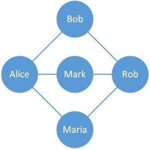

这道题出现在Hiretual 面试第二轮, 其实真没什么难的.  面试大概在2020年的8月中旬. 


题目具体记不清. 反正意思很简单, 就是有一个social network, 求social connection, 如下图, Bob和Rob之间的connection是1, Bob和Mark之间的connection是2, Bob和Maria之间的connection是2. 

拿到这道题之后因为第一轮面试, 我一开始想的是Dijkstra, 之后装模作样解释Dijkstra如何做.   
到最后想明白了, 其实这是unweighted graph, 用BFS就可以解. 不过其实最后BFS也没写对. 

面试之后我才想明白是错的, 其实BFS解不了, 因为BFS算的是过了多少个Node, 而这道题需要算过了多少层Node. BFS 从Bob 走到 Mark 需要从 Bob 到 Alice, 到Rob, 才能到Mark, 走了三个人. 这道题其实正确的解法是Level-Order traverse.  

这个面试很丢人, 到最后已经很明显的感觉面试官不耐烦了, 不想跟我废话下去. 这其实是一道简单题. 这种题是需要抓住的. 



## Level-Order Traverse

面试之后我自己一个人写的, 其实这个是有用的, 以后也许别的题目可以用到.  就是从基本的BFS改过来的的. 

注: 这个代码没有经过大量验证, 可能有错.   

代码在这个class之中的 [socialConnectionLevel 方法](https://github.com/easonback26/Graph/blob/master/src/BasicGraph.java)

```java
public int socialConnectionLevel(String root, String destination) {
    Set<String> visited = new LinkedHashSet<>();
    Set<String> lastVisited = new LinkedHashSet<>();
    visited.add(root);
    lastVisited.add(root);
    int scl =0;

    /*
        单纯的BFS其实解不了这道题. 因为BFS算的是过了多少个Node, 而这道题需要算过了多少层Node.
        用lastVisted 去track上一层的Node, 然后scl计算经过的层数. 之后这一层所有node traverse之后, 再用下一层(newVisted)把lastVisted覆盖.
        这个traverse方法对应在tree里面被称为 level order traverse, 因为是严格分层进行traverse.

        因为每一个Node和Edge其实还是只会过一次, 所以算力还是 O(V+E).   但是两个for loop不是好事, 我在想应该有更快捷简单的方法.
        注: 这道题只是用了一个很简单的graph去测试了一下. 如果可能的话, 需要更多验证.

        这种题目类型叫做: shortest path on unweighted graph. 可以搜一下geek. 有不同解法.
     */

    while (!lastVisited.isEmpty()) {
        Set<String> newVisited = new LinkedHashSet<String>();

        for (String s : lastVisited)
        {
            if(s.equals(destination))
            {
                return scl;
            }
            for (String eachVertex : this.getAdjVertices(s)) {
                if (!visited.contains(eachVertex)) {
                    visited.add(eachVertex);
                    newVisited.add(eachVertex);
                }
            }
        }

        lastVisited = newVisited;
        scl ++;

    }
    return 0;
}
```

## TrackPaths

[代码在此](https://github.com/easonback26/Graph/blob/master/src/TrackingBasicRoute.java)

上面说过了, 这是一个典型问题, 搜了一下Geek发现有范例解法. 觉得太啰嗦, 于是自己写, 写的非常简单, 在BFS里面加4行代码就搞定了. 而且因为简洁, 所以基本没有错误.  这里其实没有具体算level的问题, 不过非常简单, 直接找具体key, 然后return ArrayList的size即可.

注: 这个tracker也可以给DFS用, 不用做任何修改. **但是不能用来track优化问题的, 比如Dijkstra**, 原因在Github代码的最上面说明了. 

- 做一个class Variable, Paths, 用来track

```java
//key是String是每个vertex的label, value是路径.
private Map<String, List<String>> paths;
```
- init: 跟原来的class var 一起init就可以, 连格式也是一模一样的. 

```java
TrackingBasicRoute() {
        this.adj = new HashMap<>();
        this.paths = new HashMap<>();
    }

    void addVertex(String label) {
        adj.putIfAbsent(label, new ArrayList<>());
        paths.putIfAbsent(label, new ArrayList<>());
    }
```

- Modify BFS 两处

	- 在最开始加入root
	
	```java
	paths.put(root, new ArrayList<>());
	```
	
	- 在traverse 每个 vertex的时候继承前一个的list
	
	```java
	List<String> parentsList = new ArrayList<>(paths.get(s)); // put paths.get(S) inside the bracket to avoid copy the reference.
	parentsList.add(s);
	paths.put(eachVertex, parentsList);
	```